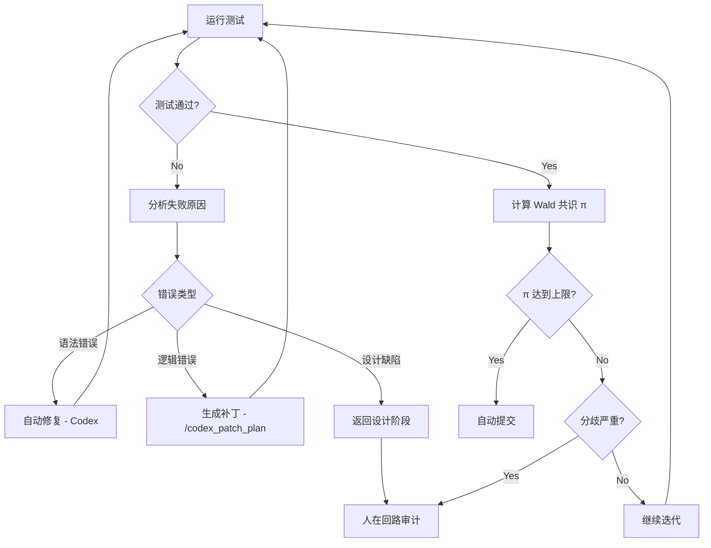

# 自愈校验命令

## 用途
执行测试验证，如果产生错误则触发自愈循环（Self-Healing Loop）。利用 Wald 序列分析算法评估理事会达成共识的概率 π，决定是否自动提交或申请人工审计。

## 主控者
**Claude Code** - 裁决阶段

## 执行方式
```bash
/self_heal "运行测试并自愈"
```

## 自愈循环流程



## 输出格式 (YAML)

```yaml
self_healing_report:
  timestamp: "2025-12-22T12:00:00Z"
  iteration: 1
  max_iterations: 5
  
  test_execution:
    command: "npm test -- --coverage"
    exit_code: 0
    duration_ms: 15234
    
    results:
      total_tests: 45
      passed: 43
      failed: 2
      skipped: 0
      coverage:
        statements: 88.5
        branches: 82.1
        functions: 91.2
        lines: 87.9
    
    failures:
      - test: "should reject expired token"
        file: "src/auth/jwt-service.test.ts:45"
        error: |
          Error: Expected function to throw "Token expired"
          But got: undefined
        stack: |
          at Object.<anonymous> (src/auth/jwt-service.test.ts:47:25)
      
      - test: "should rate limit login attempts"
        file: "src/auth/auth-flow.test.ts:78"
        error: |
          Error: Expected error code "RATE_LIMIT_EXCEEDED"
          But got: "INVALID_CREDENTIALS"
  
  failure_analysis:
    - test: "should reject expired token"
      category: "logic_error"
      root_cause: "JWT 验证逻辑未检查过期时间"
      affected_files:
        - src/auth/jwt-service.ts
      auto_fixable: true
      fix_strategy: "添加过期时间检查逻辑"
      confidence: 0.92
    
    - test: "should rate limit login attempts"
      category: "missing_feature"
      root_cause: "缺少速率限制中间件"
      affected_files:
        - src/auth/auth-service.ts
        - src/middleware/rate-limiter.ts (missing)
      auto_fixable: false
      fix_strategy: "需要实现速率限制功能"
      confidence: 0.85
  
  healing_actions:
    - action: "auto_fix"
      target: "src/auth/jwt-service.ts"
      fix_type: "add_logic"
      patch: |
        if (decoded.exp && decoded.exp < Date.now() / 1000) {
          throw new Error('Token expired');
        }
      applied: true
      verified: true
    
    - action: "generate_patch"
      target: "src/middleware/rate-limiter.ts"
      tool: "/codex_patch_plan"
      patch_plan: "rate_limiter_patch.yaml"
      applied: false
      reason: "需要人工确认设计"
  
  wald_consensus:
    algorithm: "Sequential Probability Ratio Test (SPRT)"
    
    votes:
      - agent: "Gemini Pro"
        decision: "approve"
        confidence: 0.88
        rationale: "架构设计合理,测试覆盖充分"
      
      - agent: "Codex"
        decision: "approve_with_changes"
        confidence: 0.75
        rationale: "速率限制需要补充,其他没问题"
      
      - agent: "Claude Code"
        decision: "hold"
        confidence: 0.60
        rationale: "速率限制是安全关键功能,建议人工审查"
    
    calculation:
      prior_approve: 0.7
      prior_reject: 0.3
      
      likelihood_ratio: |
        L = Π [P(vote_i | approve) / P(vote_i | reject)]
        L = (0.88 * 0.75 * 0.60) / (0.12 * 0.25 * 0.40)
        L = 0.396 / 0.012 = 33.0
      
      posterior_probability:
        π_approve: 0.958  # 95.8% 概率应该批准
        π_reject: 0.042
      
      thresholds:
        upper_limit: 0.95  # 达到则自动提交
        lower_limit: 0.30  # 低于则拒绝
        
      decision_rule: "π ≥ upper_limit → auto_commit"
      
    final_decision: "hold_for_human"
    reason: |
      虽然 π_approve = 95.8% 接近上限,但存在安全关键功能(速率限制)未实现。
      根据保守原则,申请人在回路审计。
  
  next_actions:
    - type: "implement_missing_feature"
      description: "实现速率限制中间件"
      tool: "/codex_patch_plan rate_limiter"
      blocking: true
    
    - type: "re_run_tests"
      description: "实现后重新运行所有测试"
      blocking: true
    
    - type: "human_review"
      description: "安全团队审查速率限制实现"
      blocking: true
      reviewers: ["security-lead"]
  
  rollback_checkpoint:
    git_sha: "a3f9c2e"
    timestamp: "2025-12-22T11:50:00Z"
    clean_state: true
    command: "git reset --hard a3f9c2e"

verification:
  - cmd: "npm test 2>&1 | grep -E 'Tests.*(passed|failed)'"
    expected: "显示测试结果统计"
  
  - cmd: "git diff --stat"
    expected: "显示自愈过程中的改动"
```

## 自愈策略

### 1. 自动修复 (Auto-Fix)
**适用场景**:
- 语法错误 (missing semicolon, typo)
- 简单逻辑错误 (null check, boundary condition)
- Import/Export 错误

**条件**:
- `confidence ≥ 0.90`
- `affected_files ≤ 3`
- `diff_lines ≤ 50`

### 2. 生成补丁 (Generate Patch)
**适用场景**:
- 复杂逻辑错误
- 缺少边界条件处理
- 性能问题

**工具**: `/codex_patch_plan`

### 3. 返回设计 (Redesign)
**适用场景**:
- 架构缺陷
- 缺少核心功能
- 测试覆盖率 < 70%

**工具**: `/audit_design`

### 4. 人在回路 (Human-in-the-Loop)
**触发条件**:
- Wald π 分歧严重 (0.3 < π < 0.7)
- 安全关键功能变更
- 多次自愈失败 (iteration ≥ 3)

## Wald 共识算法详解

### 公式
```
似然比 L = Π [P(vote_i | H_approve) / P(vote_i | H_reject)]

后验概率 π = (prior * L) / (prior * L + (1 - prior))

决策规则:
  if π ≥ 0.95: auto_commit()
  elif π ≤ 0.30: reject_and_rollback()
  else: hold_for_human_review()
```

### 参数调优
- **upper_limit = 0.95**: 高置信度才自动提交,避免误判
- **lower_limit = 0.30**: 明确不合格的直接拒绝
- **prior_approve = 0.7**: 先验概率偏向批准,鼓励快速迭代

## 最大迭代次数

**默认**: 5 次
**超过后**: 强制申请人工审计并创建详细报告

## 使用示例

```bash
# 完整流程
/prd_generate "用户登录"
/audit_design "登录架构"
/tdd_tests "生成登录测试"
/batch_executor execution_plan.yaml  # 实现代码
/self_heal  # 运行测试并自愈

# 如果自愈失败,查看报告
cat self_healing_report.yaml

# 手动修复后重新自愈
/self_heal
```

## 成功标准

1. ✅ 所有测试通过
2. ✅ 代码覆盖率 ≥ 90%
3. ✅ Wald π ≥ 0.95 (或人工批准)
4. ✅ 无安全漏洞 (通过 security_tests)
5. ✅ 性能指标达标 (通过 performance_tests)

## 下游命令
- 自愈成功 → `/checkpoint` (创建检查点)
- 自愈失败且无法修复 → git reset --hard (回滚)
- 需要人工介入 → 生成详细报告并暂停
