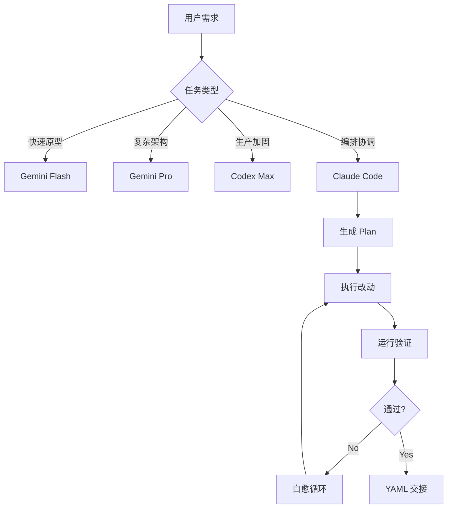

# 代码地图 (Code Map)

> [!NOTE]
> 本文档提供项目的整体结构视图，帮助 AI 智能体快速理解项目上下文，无需读取万行代码。

## 项目概览

**项目名称**: caicai  
**项目类型**: AI 开发环境配置与工作流管理  
**主要用途**: 多 CLI 智能体协同开发（Claude Code + Codex + Gemini）

## 目录结构

```
caicai/
├── .ai/                      # AI 相关配置（空）
├── .claude/                  # Claude Code 配置
│   ├── commands/            # 自定义命令
│   │   ├── codex_patch_plan.md
│   │   └── codex_review.md
│   ├── settings.json        # 权限配置
│   └── settings.local.json
├── .git/                    # Git 仓库
├── docs/                    # 文档目录
│   ├── PLUGINS_MINIMAL.md
│   └── WORKFLOW.md
├── playground/              # 测试/原型代码
│   ├── index.html
│   ├── script.js
│   └── styles.css
├── tools/                   # 工具脚本
│   ├── ai/
│   └── aiw.ps1             # Windows AI 包装器
├── .mcp.json               # MCP 服务器配置
├── AGENTS.md               # 智能体理事会治理规则
├── CLAUDE.md               # Claude Code 协作契约
└── setup-ai-env.ps1        # Windows 环境配置脚本
```

## 核心配置文件

### 1. [AGENTS.md](file:///home/dabah123/projects/caicai/AGENTS.md)
**作用**: 智能体理事会的"单一事实来源"
- 定义 Small Diffs、防御性编程等核心规则
- 规定交付格式（强制 YAML）
- 定义模型分工：
  - **Gemini Flash**: 快速原型、脚手架
  - **Gemini Pro**: 复杂架构、长上下文审阅
  - **Codex Max**: 生产加固、测试、边界条件
  - **Claude Code**: 任务编排、plan + 验收

### 2. [CLAUDE.md](file:///home/dabah123/projects/caicai/CLAUDE.md)
**作用**: Claude Code 的工作流契约
- 强制引用 AGENTS.md
- 定义四步工作流：plan → code → verify → handoff
- MCP 工具清单
- 硬性约束（Small diffs ≤200行、必须带验证）

### 3. [.mcp.json](file:///home/dabah123/projects/caicai/.mcp.json)
**作用**: MCP 服务器配置
- **filesystem**: 文件系统访问
- **codex**: Codex MCP 服务器
- **gemini**: Gemini CLI MCP 服务器

### 4. [.claude/settings.json](file:///home/dabah123/projects/caicai/.claude/settings.json)
**作用**: Claude Code 权限配置
- **deny**: 敏感文件（.env, *.key, secrets/**）
- **allow**: Git 只读操作、包管理、AI 工具调用
- **ask**: Git 提交/推送、文件删除

## MCP 工具

### Codex 命令
- `/codex_review`: 风险扫描（blocker/major/minor）
- `/codex_patch_plan <目标>`: 最小补丁计划（≤200行）

### 预期扩展
- PRD 生成
- 架构审计
- TDD 测试生成
- 自愈校验
- 检查点总结

## 核心原则

1. **Small Diffs**: 每次改动 ≤200 行
2. **防御性编程**: 空值/异常/竞态必须处理
3. **可验证**: 每个改动必须带验证命令 + 预期结果
4. **可回滚**: 每个操作必须有回滚步骤
5. **结构化交付**: 一律使用 YAML/JSON 格式

## 工作流模式



## 安全边界

- 禁止访问：`.env`, `*.key`, `secrets/**`
- Git 操作：提交/推送需要用户确认
- 文件删除：需要用户确认
- Docker 沙箱：建议所有代码在容器中运行

## 项目状态

- **已配置**: 基础治理规则、MCP 服务器、权限管理
- **待实现**: 完整六步自愈循环、TDD 强制约束、Docker 沙箱、Git Worktrees
