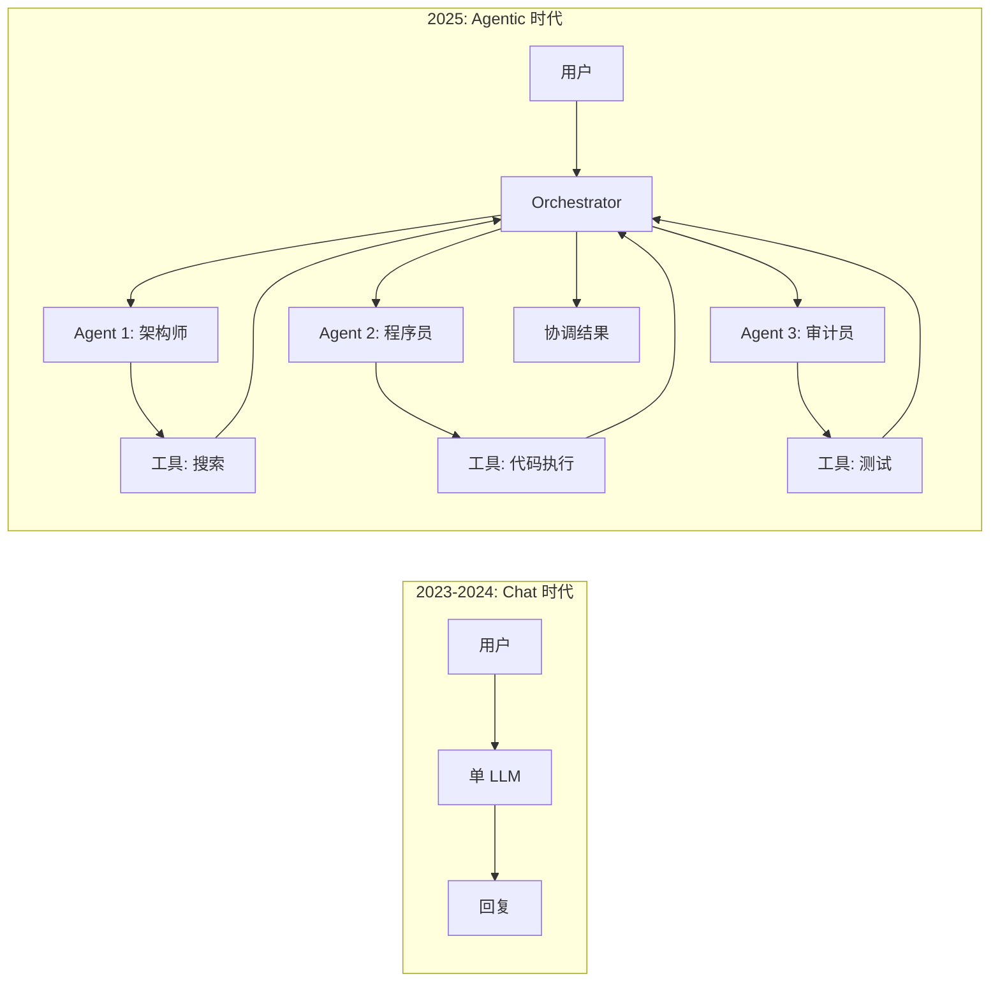
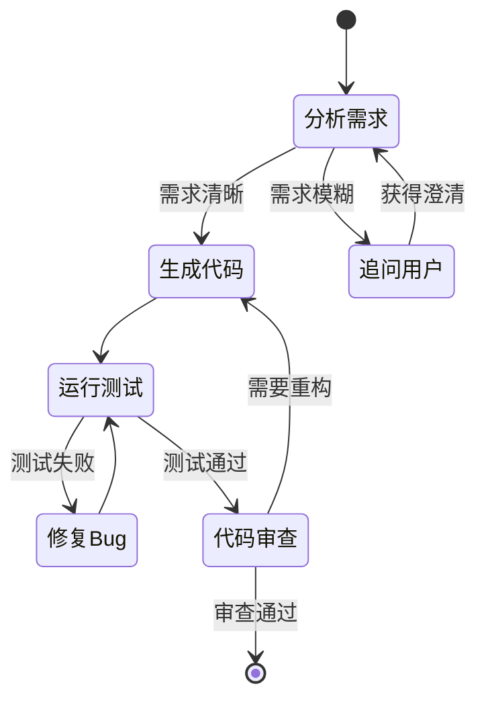
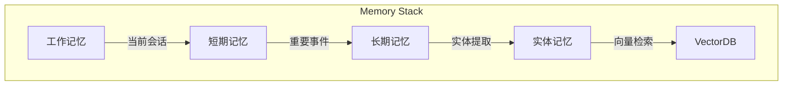
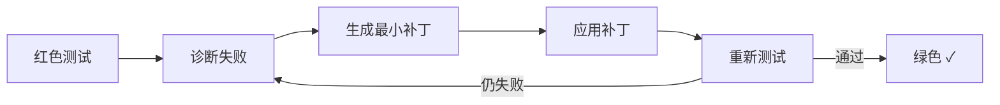
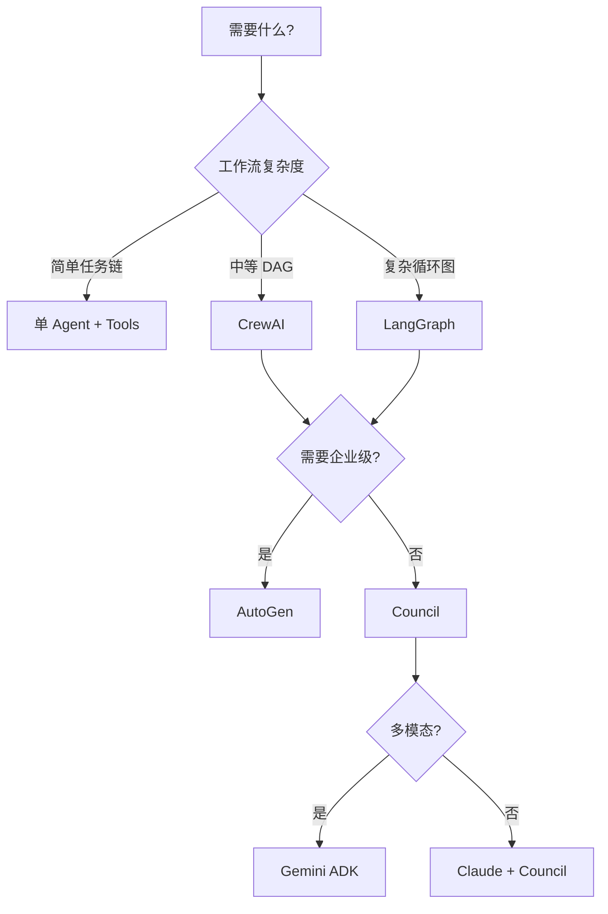

# Council 1.0.0 最佳实践：最强智能体架构

> **基于 2024 年末至 2025 年初行业最新研究**
> 综合 Anthropic Claude、Google Gemini、OpenAI、LangGraph、CrewAI、AutoGen 等框架的核心设计理念

---

## 一、2025 核心范式：从 Chat 到 Agentic



**关键转变**：

| 维度 | Chat 模式 | Agentic 模式 |
|:----:|:--------:|:-----------:|
| 交互 | 单轮/多轮对话 | 自主任务执行 |
| 工具 | 可选增强 | 核心能力 |
| 状态 | 会话窗口内 | 持久化 + 检查点 |
| 控制 | 用户主导 | 目标驱动自主 |
| 错误处理 | 人工干预 | 自愈循环 |

---

## 二、最强智能体七大支柱

### 1. 模块化专业化 (Specialization)

> **原则**：一个智能体只做一件事，做到极致

```python
# ✅ Good: 专业化
class CodeReviewAgent(BaseAgent):
    """只负责代码审查，不碰其他"""
    name = "ReviewBot"
    system_prompt = "你是一个严格的代码审查员..."

# ❌ Bad: 全能型
class SuperAgent(BaseAgent):
    """又写代码又审查又部署..."""
```

**最佳实践来源**：

- **Anthropic Claude**: 多智能体 Research 系统用专业 subagent 分工
- **CrewAI**: 角色制架构，每个 Agent 有明确的 Role/Goal
- **Google ADK**: 支持构建多专业智能体协作

### 2. 图式编排 (Graph-based Orchestration)

> **原则**：用显式图结构管理复杂工作流



**关键设计**：

- **状态管理**: 检查点 (Checkpoint) 支持断点续传
- **循环图**: 允许回溯和迭代（与 DAG 不同）
- **条件路由**: 基于运行时结果动态决策

**Council 实现**：

```python
from council.orchestration import TaskClassifier, DelegationRouter

router = DelegationRouter(lead_agent, [specialist_1, specialist_2])
result = await router.route(task)  # 自动选择最优路径
```

### 3. 工具优先 (Tool-First Design)

> **原则**：每个外部能力都是一个严格契约的工具

**Claude 官方推荐**：

| 元素 | 要求 | 示例 |
|:----:|:----:|:----:|
| `name` | 动词_名词 | `search_database` |
| `description` | 详细说明何时使用 | "当需要查询历史数据时使用..." |
| `input_schema` | 精确 JSON Schema | `{"type": "object", ...}` |
| `input_examples` | 真实示例 (Beta) | `[{"query": "SELECT..."}]` |

**Programmatic Tool Calling** (Anthropic 2024 新特性)：
让 Claude 写 Python 代码调用多个工具，而不是一个个调用：

```python
# Claude 可以生成并执行这样的代码
results = []
for symbol in ["BTC", "ETH", "SOL"]:
    data = await tools.fetch_market_data(symbol=symbol)
    results.append(data)
analysis = await tools.analyze_portfolio(data=results)
```

### 4. 状态与记忆 (State & Memory)

> **原则**：短期记忆、长期记忆、实体记忆分离



**Council 已实现**：

- `TieredMemory`: 分层记忆架构
- `VectorMemory`: 向量存储和检索
- `SqliteStateStore` / `RedisStateStore`: 持久化检查点

**最佳实践**：

```python
# 上下文隔离：每个 subagent 只看自己需要的
subagent_ctx = orchestrator_ctx.slice(relevant_keys=["task", "constraints"])

# 定期压缩：防止上下文溢出
if trigger.should_compact(ctx):
    ctx = await compactor.compact(ctx)
```

### 5. 共识机制 (Consensus)

> **原则**：多个智能体意见分歧时，需要数学可验证的裁决

**Council Wald 序列共识**：

```python
from council.facilitator import WaldConsensus

consensus = WaldConsensus(
    prior=0.5,         # 初始信念
    upper_limit=0.95,  # 自动通过阈值
    lower_limit=0.30,  # 自动拒绝阈值
)

result = consensus.evaluate(votes=[
    {"agent": "architect", "decision": "APPROVE", "confidence": 0.9},
    {"agent": "security", "decision": "REJECT", "confidence": 0.7},
])
# -> HOLD_FOR_HUMAN (需要人类介入)
```

**优势**：

- 动态终止：达到共识立即停止，节省 Token
- 概率可解释：每个决策都有数学依据
- 防止幻觉螺旋：低置信度时主动求助

### 6. 安全与治理 (Safety & Governance)

> **原则**：最小权限 + 强制审批 + 全链路可观测

**三层防护**：

```
┌─────────────────────────────────────┐
│  Layer 1: 预定义 Blocklist          │  rm -rf, DROP TABLE, env vars
├─────────────────────────────────────┤
│  Layer 2: 风险分级审批               │  HIGH → Human, MEDIUM → Council
├─────────────────────────────────────┤
│  Layer 3: 沙箱执行                   │  Docker/E2B 隔离
└─────────────────────────────────────┘
```

**Council 实现**：

```python
# 治理网关
if gateway.requires_approval(action):
    decision = await gateway.request_human_approval(action)
    if not decision.approved:
        raise OperationBlocked(reason=decision.rationale)

# 沙箱执行
from council.sandbox import DockerSandboxRunner
runner = DockerSandboxRunner(timeout=30)
result = await runner.execute(untrusted_code)
```

### 7. 自愈循环 (Self-Healing Loop)

> **原则**：测试先行、小步快跑、闭环验证



**关键指标**：

- **Time to Green**: 从红到绿的平均时间
- **Patch Size**: 每次补丁的行数（越小越好）
- **Iteration Count**: 迭代次数（3 以内为优）

---

## 三、框架选型决策树



**Council 定位**:

- 中等复杂度工作流
- 注重共识决策和治理
- 轻量级、可嵌入

---

## 四、1.0.0 待实现清单

### P0: 生产就绪

- [ ] **LLM PatchGenerator**: 真正的 AI 修复能力（当前为 stub）
- [ ] **Human-in-the-Loop UI**: Web/CLI 审批界面
- [ ] **生产级 Redis 集成**: 分布式状态和锁

### P1: 增强能力

- [ ] **Programmatic Tool Calling**: Claude 式代码调用工具
- [ ] **Multi-Model Router**: 根据任务自动选 Claude/Gemini/GPT
- [ ] **流式输出增强**: 实时显示思考过程

### P2: 生态集成

- [ ] **LangChain 工具桥接**: 复用 LangChain 工具库
- [ ] **MCP 服务端**: 标准协议暴露 Council 能力
- [ ] **Prometheus 指标**: 生产监控

---

## 五、参考资源

| 来源 | 链接 | 关键内容 |
|:----:|:----:|:-------:|
| Anthropic Agent SDK | [docs.anthropic.com](https://docs.anthropic.com) | tool use, subagent |
| Google ADK | [googleblog.com](https://developers.googleblog.com) | 多智能体编排 |
| OpenAI Agents | [openai.com/agents](https://openai.com) | 状态/记忆/编排 |
| LangGraph | [langchain.com](https://langchain.com) | 图式状态机 |
| CrewAI | [crewai.com](https://crewai.com) | 角色制团队 |
| AutoGen | [microsoft/autogen](https://github.com/microsoft/autogen) | 企业级对话 |

---

*Council 1.0.0 目标：成为 Python 生态中最轻量、最注重治理的多智能体框架*
