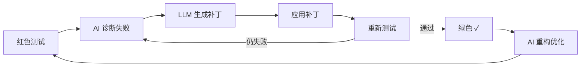

# 2025 多模型智能体完整最佳实践指南

> **版本**: 2.0.0
> **更新日期**: 2025-12-31
> **来源**: MCP 深度搜索综合

---

## 一、核心协议栈 (2025 标准)

| 协议 | 发起方 | 功能 | 状态 |
|------|--------|------|------|
| **MCP** (Model Context Protocol) | Anthropic | Agent ↔ 工具/数据 | 行业标准 |
| **A2A** (Agent-to-Agent) | Google | Agent ↔ Agent 通信 | Linux Foundation 托管 |
| **OpenAI Agents SDK** | OpenAI | Agent 交接 + 工具 | 生产就绪 |

```
┌─────────────────────────────────────────────────────────┐
│                    外部世界 (APIs/DBs)                   │
└─────────────────────────────────────────────────────────┘
                           ▲
                           │ MCP (工具调用)
                           ▼
┌─────────────────────────────────────────────────────────┐
│                    AI Agent 集群                         │
│  ┌──────────┐    A2A    ┌──────────┐   A2A   ┌────────┐ │
│  │ 架构师   │◄────────►│ 程序员   │◄──────►│ 审计员 │ │
│  └──────────┘           └──────────┘         └────────┘ │
│        │                     │                    │     │
│        └─────────────────────┼────────────────────┘     │
│                              ▼                          │
│                    ┌──────────────────┐                 │
│                    │   Orchestrator   │                 │
│                    └──────────────────┘                 │
└─────────────────────────────────────────────────────────┘
```

---

## 二、五大架构模式

### 1. 层级监督模式 (Hierarchical Supervisor)

**结构**: 树状结构，Manager → Sub-Manager → Worker

**最佳用途**: 复杂可分解任务 (如: PM → Tech Lead → Dev/QA)

**代表框架**: AutoGen, LangGraph

```python
# Council 实现
orchestrator = Orchestrator(
    lead_agent=Architect(),
    sub_agents=[Coder(), Auditor()]
)
```

### 2. 状态图模式 (Stateful Graph)

**结构**: 状态机，节点为 Agent，边定义转换逻辑

**最佳用途**: 需要审计的业务流程，循环工作流

**代表框架**: LangGraph

```python
# Council 实现
graph = StateGraph()
graph.add_edge("analyze", "code", condition=lambda s: s.clarity > 0.8)
graph.add_edge("code", "review")
graph.add_edge("review", "code", condition=lambda s: not s.approved)
```

### 3. 动态群体模式 (Dynamic Swarm)

**结构**: 扁平网络，任意 Agent 可交接

**最佳用途**: 开放式探索，客服

**代表框架**: OpenAI Swarm

```python
# Council 实现
from council.orchestration import AgentHandoff, HandoffManager

handoff_manager = HandoffManager()
handoff = handoff_manager.initiate_handoff(
    from_agent="Orchestrator",
    to_agent="Coder",
    task_summary="实现登录功能",
    reason="需要代码专业知识"
)
```

### 4. 双系统认知模式 (Dual-System Cognitive)

**结构**: 快思考 (上下文窗口) + 慢思考 (长期记忆)

**最佳用途**: 长时运行的个人助手

**代表框架**: Agno, MemGPT

### 5. 角色扮演 SOP 模式 (Role-Playing SOP)

**结构**: Agent 遵循严格的标准操作流程

**最佳用途**: 复制企业工作流 (PRD → 设计 → 代码 → 审查)

**代表框架**: MetaGPT, CrewAI

---

## 三、框架选型决策矩阵

| 需求场景 | 推荐框架 | Council 对标 |
|----------|----------|--------------|
| 复杂状态流、需要精确控制 | **LangGraph** | StateGraph |
| 快速原型、角色分工明确 | **CrewAI** | Agent + Prompts |
| 对话驱动、企业级 | **AutoGen** | Hub + A2A Bridge |
| 轻量级交接 | **OpenAI Swarm** | HandoffManager |
| 多模态 (视觉/音频) | **Gemini ADK** | 待集成 |

---

## 四、共识与投票机制

### Wald 序列概率比检验 (SPRT)

Council 使用 Wald SPRT 实现数学可验证的共识决策：

```python
from council.facilitator import WaldConsensus

consensus = WaldConsensus(
    upper_limit=0.95,  # π ≥ 0.95 → AUTO_COMMIT
    lower_limit=0.30,  # π ≤ 0.30 → REJECT
)

result = consensus.evaluate(votes=[
    {"agent": "Architect", "decision": "approve", "confidence": 0.9},
    {"agent": "Coder", "decision": "approve", "confidence": 0.85},
    {"agent": "Auditor", "decision": "hold", "confidence": 0.6},
])
# → HOLD_FOR_HUMAN (需人工审核)
```

### 共识 vs 投票研究结论

| | 共识协议 | 投票协议 |
|---|----------|----------|
| **优势场景** | 知识任务 (需消除错误) | 推理任务 (需多路径探索) |
| **机制** | 迭代讨论直到一致 | 独立投票后聚合 |
| **Council 实现** | WaldConsensus | 待扩展 |

---

## 五、MCP 搜索服务器

| 服务器 | 功能 | API 来源 |
|--------|------|----------|
| **Tavily** | AI 优化搜索 + RAG | tavily.com |
| **Brave Search** | 隐私搜索 + AI 摘要 | brave.com |
| **Exa** | 结构化搜索 + 学术论文 | exa.ai |

---

## 六、Council 实现状态对照

| 2025 最佳实践 | Council 模块 | 状态 |
|---------------|--------------|------|
| MCP 协议 | `ai_council_server.py` | ✅ |
| A2A 协议 | `a2a_bridge.py` | ✅ |
| Agent 交接 | `handoff.py` | ✅ |
| 共识机制 | `wald_consensus.py` | ✅ |
| 治理网关 | `gateway.py` | ✅ |
| 自愈循环 | `patch_generator.py` | ✅ |
| 可观测性 | `middleware.py` | ✅ |
| 本地记忆 | `LocalMemory` | ✅ |

---

## 七、记忆架构 (2025 最新)

### 分层记忆堆栈

```
┌───────────────────────────────────────┐
│  工作记忆 (LLM Context Window)        │  ← 128k tokens
├───────────────────────────────────────┤
│  短期记忆 (Session State)              │  ← Redis/SQLite
├───────────────────────────────────────┤
│  情景记忆 (Vector DB)                  │  ← Chroma/Qdrant/Pinecone
│  "发生了什么事?"                        │
├───────────────────────────────────────┤
│  语义记忆 (Knowledge Graph)            │  ← Neo4j/FalkorDB
│  "概念如何关联?"                        │
├───────────────────────────────────────┤
│  时序知识图谱 (TKG)                     │  ← Graphiti/Zep
│  "何时发生? 如何演变?"                  │
└───────────────────────────────────────┘
```

### RAG 进化路径

| 阶段 | 特点 | Council 状态 |
|------|------|--------------|
| Vanilla RAG | 只读，检索 + 生成 | ✅ VectorMemory |
| Agentic RAG | 动态决策何时检索 | ✅ AdaptiveRouter |
| Agent Memory | 读写，持续学习 | ✅ LocalMemory |

**最佳实践**:
- 混合搜索: Vector + BM25 + 元数据过滤
- 定期裁剪: 删除过期记忆
- 经验质量管理: 用后续评估作为记忆标签

---

## 八、自愈循环 (TDD 驱动)

### 红-绿-重构 AI 循环



### 关键指标

| 指标 | 目标 |
|------|------|
| Time to Green | < 5 分钟 |
| Patch Size | < 20 行 |
| Iteration Count | ≤ 3 次 |

### Council 实现

```python
from council.self_healing import PatchGenerator

generator = PatchGenerator()
patch = generator.generate_patch(
    test_output="AssertionError: expected 5, got 4",
    source_code=open("calculator.py").read(),
    test_code=open("test_calculator.py").read()
)
```

---

## 九、Human-in-the-Loop 治理

### HITL 审批工作流

```
1. Agent 收到任务
       ↓
2. AI 生成草案/建议行动
       ↓
3. [风险评估] → 低风险 → 自动执行
       ↓ 高风险
4. 暂停，等待人工审核
       ↓
5. 人类 [批准/拒绝/修改]
       ↓
6. 记录审批决策 → 继续执行
```

### 风险分级

| 级别 | 行动类型 | 审批要求 |
|------|----------|----------|
| LOW | 读取、查询 | 自动执行 |
| MEDIUM | 创建、修改 | Council 共识 |
| HIGH | 删除、外部API | 人工审批 |
| CRITICAL | 系统操作、生产部署 | 双人审批 |

### 2025 合规要求

- **EU AI Act**: 高风险 AI 必须人工监督
- **US AI EO**: 透明度 + 可审计日志
- **Council 实现**: `GovernanceGateway.check_safety()` + CircuitBreaker

---

## 参考资源

- [modelcontextprotocol.io](https://modelcontextprotocol.io) - MCP 官方文档
- [langchain.com/langgraph](https://langchain.com/langgraph) - LangGraph 文档
- [crewai.com](https://crewai.com) - CrewAI 框架
- [microsoft/autogen](https://github.com/microsoft/autogen) - AutoGen 仓库
- [anthropic.com](https://docs.anthropic.com) - Anthropic Agent 文档

---

*更新时间: 2025-12-31T12:55:00Z*
