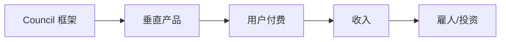

# Council 战略建议：独立开发者的务实路径

> **给你的真话**：基于市场数据、竞争格局、和一个人开发的现实约束

---

## 一、残酷的现实

### 市场数据 (2024-2025)

| 指标 | 数值 | 来源 |
|:----:|:----:|:----:|
| AI Agent 市场规模 | $5.25B → $7.84B | Grand View Research |
| 企业采用率 | 79% 已部署 | 2025 调研 |
| 扩展计划 | 96% IT 领导计划扩展 | 行业报告 |

### 竞争对手融资情况

| 框架 | 融资 | 估值 | ARR | 团队 |
|:----:|:----:|:----:|:---:|:----:|
| **LangChain** | $35M+ | $200M→$1.1B | ~$8-16M | 50+ |
| **CrewAI** | $18M | 未公开 | 增长中 | 20+ |
| **AutoGen** | 微软内部 | N/A | N/A | 微软团队 |
| **Council** | $0 | $0 | $0 | **1人** |

### 真相

```
你 vs LangChain = 1人 vs 50+人团队 + $35M资金
你 vs CrewAI = 1人 vs 20+人团队 + $18M资金 + Andrew Ng背书
```

**结论**：正面竞争是自杀行为。

---

## 二、独立开发者成功案例分析

### 案例 1: OpenWebUI (Tim Baek)

- **做什么**: 本地 LLM 界面
- **策略**: 专注隐私、离线使用
- **成果**: GitHub Accelerator 入选

### 案例 2: SiteGPT (Bhanu Teja)

- **做什么**: 网站聊天机器人生成器
- **策略**: 垂直聚焦 + 快速变现
- **成果**: 月收入快速增长

### 案例 3: Writesonic (Samanyou Garg)

- **做什么**: AI 写作助手
- **策略**: 利用开源模型 + SaaS
- **成果**: 多百万 ARR, 1000万用户

### 共同模式

```
❌ 构建通用框架与巨头竞争
✅ 专注垂直场景 + 快速变现 + 利用已有开源工具
```

---

## 三、战略选项分析

### 选项 A: 继续通用框架路线

| 优势 | 劣势 |
|:----:|:----:|
| 技术深度好 | 1人无法匹敌50人团队 |
| 架构独特 (Wald共识) | 市场已饱和 |
| 治理特性 | 推广需要大量资源 |

**预期结果**: 小众技术项目，GitHub 几百星，无商业价值

**适合你吗**: ❓ 只有当你有其他收入来源，且只是为了技术乐趣

---

### 选项 B: 垂直产品化

**策略**: 用 Council 作为底层，构建一个解决具体问题的产品



**潜在垂直场景**:

| 场景 | 市场 | 竞争 | 独立开发者友好度 |
|:----:|:----:|:----:|:---------------:|
| **代码审查 Agent** | 开发者 | 中 | ⭐⭐⭐⭐ |
| **合规审计 Agent** | 企业 | 低 | ⭐⭐⭐ |
| **文档生成 Agent** | 开发者 | 高 | ⭐⭐ |
| **研究助理 Agent** | 学术/咨询 | 中 | ⭐⭐⭐⭐ |

**推荐**: Council + 代码审查 = "AI Code Council"

- 利用你已有的共识机制
- 开发者是容易触达的市场
- 可以免费增值模式

**预期结果**: 6-12个月可能有付费用户

---

### 选项 C: 放弃框架，转向应用

**策略**: 完全放弃 Council 框架开发，直接基于 LangGraph/CrewAI 构建应用

| 优势 | 劣势 |
|:----:|:----:|
| 站在巨人肩膀上 | 放弃技术积累 |
| 更快进入市场 | 依赖外部框架 |
| 专注价值交付 | 无技术壁垒 |

**适合你吗**: ✅ 如果你的目标是赚钱，而不是做开源项目

---

### 选项 D: 混合策略 (推荐)

**策略**: Council 作为"内部引擎" + 快速发布一个垂直产品

```
阶段 1 (0-3月): 发布 Council 1.0.0 最小版本
阶段 2 (3-6月): 基于 Council 构建 "AI Code Council" 产品
阶段 3 (6-12月): 产品验证 → 有收入 → 继续迭代
```

**为什么这个策略**:

1. 不放弃技术积累
2. 用产品验证框架
3. 有收入可能性
4. 如果失败，至少有一个成熟框架

---

## 四、务实的 1.0.0 范围

### 砍掉什么

| 特性 | 原计划 | 建议 | 原因 |
|:----:|:------:|:----:|:----:|
| 分布式Redis | 完整实现 | 保留Mock | 1人无法维护分布式系统 |
| 多模型路由 | 自动选择 | 手动指定 | 过度工程 |
| MCP协议 | 完整实现 | 不做 | 低优先级 |
| Docker沙箱 | 生产级 | 本地subprocess | 够用 |
| HITL UI | Web界面 | CLI确认 | 最小可行 |

### 保留什么

| 特性 | 原因 |
|:----:|:----:|
| Wald 共识 | **核心差异化** |
| BaseAgent 架构 | 基础能力 |
| 治理网关 | 安全底线 |
| AgentTracer | 调试必需 |
| CLI 工具 | 用户体验 |

### 真正的 1.0.0 Checklist

```
[ ] Wald 共识稳定
[ ] CLI council run 可用
[ ] BaseAgent + 3个示例
[ ] 治理网关基础版
[ ] 文档 + README
[ ] PyPI 发布
```

---

## 五、时间分配建议

假设你每周有 **20 小时** 用于此项目：

| 活动 | 时间占比 | 每周小时 |
|:----:|:-------:|:-------:|
| 框架开发 | 30% | 6h |
| 产品开发 | 40% | 8h |
| 推广/社区 | 20% | 4h |
| 学习/研究 | 10% | 2h |

**关键**: 不要把 100% 时间花在框架上

---

## 六、商业模式建议

### 免费增值 (Freemium)

```
Free Tier: Council CLI + 基础功能
Pro Tier: $19/月
  - 托管治理网关
  - 审计日志
  - 优先支持
Enterprise: $99/月
  - SSO
  - 自定义策略
  - SLA
```

### 或者: 一次性付费

```
Council Pro License: $199 一次性
  - 商业使用授权
  - 高级模块 (分布式状态等)
  - 1年更新
```

---

## 七、我的最终建议

### 如果你想赚钱

→ **选项 D**: Council 1.0.0 最小版本 + "AI Code Council" 产品

### 如果你只是技术爱好

→ **选项 A**: 继续把 Council 做成精品开源项目，不考虑商业

### 如果你时间有限

→ **选项 C**: 放弃框架，用 CrewAI/LangGraph 构建应用

---

## 八、接下来一个月该做什么

### 第1周: 决策

- [ ] 确定走哪条路
- [ ] 如果选 D，确定垂直场景

### 第2-3周: Council 1.0.0 最小发布

- [ ] 砍掉非核心功能
- [ ] 修复所有测试
- [ ] 发布到 PyPI

### 第4周: 产品原型

- [ ] 构建 "AI Code Council" MVP
- [ ] 在 1-2 个开源项目上测试
- [ ] 写产品 Landing Page

---

*这份建议可能让你不舒服，但这是真话。*
*1人 vs 50人 + $35M 的战争，需要智取，不能硬拼。*
