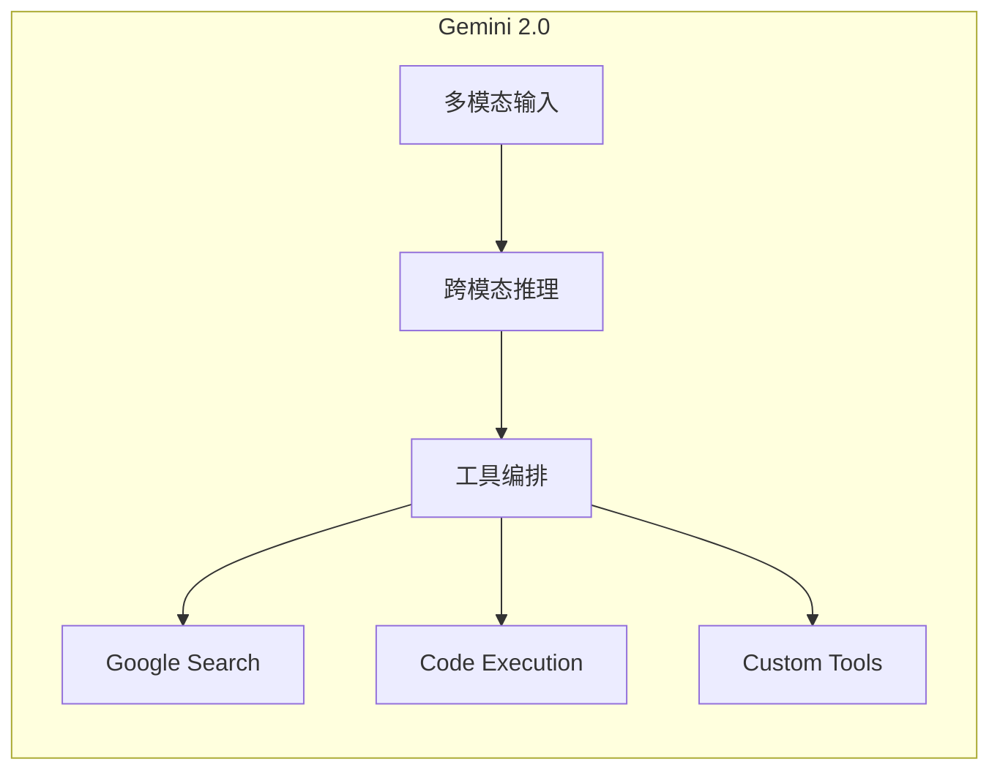
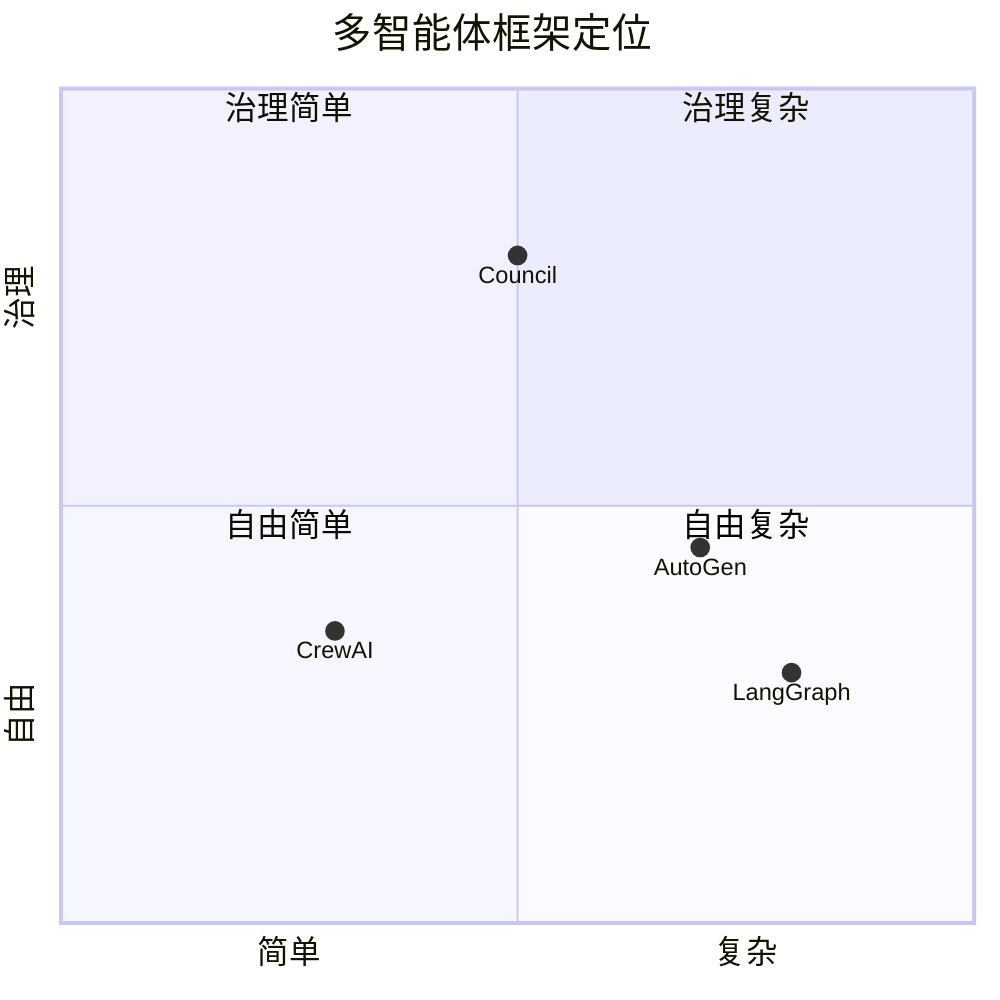

# 最强 AI 智能体深度分析 (2024-2025)

> **研究目标**：解构当今最强智能体系统的核心架构，为 Council 1.0.0 提供设计参考

---

## 一、顶级智能体系统对比

### 1. Claude Agent (Anthropic)

**核心特征**：

- **多智能体研究系统**: 主 Agent 规划 → 并行 Subagent 搜索 → 结果汇总
- **Extended Thinking**: 可控的思考便签簿，用于规划和评估
- **Programmatic Tool Calling**: Claude 写代码调用工具，而非逐个调用

**架构亮点**：

```
┌─────────────────────────────────────────┐
│           Lead Agent (规划)              │
│  - 分解任务为子任务                      │
│  - 分配给 Subagents                     │
│  - 合成最终结果                         │
└─────────────┬───────────────────────────┘
              │ spawn
    ┌─────────┼─────────┐
    ▼         ▼         ▼
┌───────┐ ┌───────┐ ┌───────┐
│Search │ │Search │ │Search │ (并行执行)
│Agent 1│ │Agent 2│ │Agent 3│
└───────┘ └───────┘ └───────┘
```

**关键实践**：

1. **详细工具描述** > 简短名称
2. **隔离 Subagent 上下文**: 只传相关信息
3. **Orchestrator 维护全局计划**

---

### 2. Gemini Agent (Google)

**核心特征**：

- **原生多模态**: 文本、图像、音频、视频同时处理
- **Agent Development Kit (ADK)**: 开源、模型无关
- **沙箱执行**: 每个 session 在隔离容器中运行

**架构亮点**：



**关键实践**：

1. **多模态作为一等公民**: 不是附加功能
2. **Grounding with Search**: 搜索增强降低幻觉
3. **安全隔离执行**: 容器/VM 级别

---

### 3. OpenAI Agents

**核心特征**：

- **可组合原语**: Model + Tools + State + Orchestration
- **Responses API**: 有状态、内置工具
- **Agent Skills**: 通用计算机访问能力

**架构亮点**：

| 组件 | 职责 |
|:----:|:----:|
| Model | 推理引擎 |
| Tools | 外部能力 |
| State | 上下文记忆 |
| Orchestration | 流程控制 |

**关键实践**：

1. **循环执行**: 工具调用 → 评估 → 决策
2. **Graceful Failover**: 工具失败优雅降级
3. **默认有状态**: 自动管理对话历史

---

## 二、多智能体框架横评

| 维度 | LangGraph | CrewAI | AutoGen | Council |
|:----:|:---------:|:------:|:-------:|:-------:|
| **架构** | 图状态机 | 角色团队 | 对话协作 | 共识治理 |
| **复杂度** | 高 | 低 | 中 | 中 |
| **状态管理** | ⭐⭐⭐⭐⭐ | ⭐⭐⭐ | ⭐⭐⭐ | ⭐⭐⭐⭐ |
| **工具集成** | LangChain 全量 | 自定义 | 灵活 | 可扩展 |
| **生产就绪** | 是 | 是 | 是 | 开发中 |
| **共识机制** | 无 | 无 | 投票 | **Wald SPRT** |
| **治理** | 无 | 无 | 基础 | **核心能力** |

### LangGraph 深度解析

**适用场景**：

- 复杂、多步骤工作流
- 需要精确控制流程
- RAG 增强应用

**核心概念**：

```python
from langgraph.graph import StateGraph

workflow = StateGraph(state_class=TaskState)
workflow.add_node("analyze", analyze_task)
workflow.add_node("execute", execute_task)
workflow.add_node("verify", verify_result)

workflow.add_edge("analyze", "execute")
workflow.add_conditional_edges("execute", route_on_result)
workflow.add_edge("verify", END)
```

### CrewAI 深度解析

**适用场景**：

- 快速原型
- 角色清晰的团队协作
- MVP 构建

**核心概念**：

```python
from crewai import Agent, Task, Crew

researcher = Agent(role="Researcher", goal="Find accurate data")
writer = Agent(role="Writer", goal="Create compelling content")

crew = Crew(agents=[researcher, writer], tasks=[task1, task2])
result = crew.kickoff()
```

### AutoGen 深度解析

**适用场景**：

- 企业级工作流
- 自主代码生成
- 需要人类干预的对话

**核心概念**：

```python
from autogen import AssistantAgent, UserProxyAgent

assistant = AssistantAgent("assistant", llm_config=config)
user_proxy = UserProxyAgent("user", human_input_mode="TERMINATE")

user_proxy.initiate_chat(assistant, message="Write a function...")
```

---

## 三、Council 竞争优势分析

### 差异化定位



**Council 独特价值**：

| 特性 | 其他框架 | Council |
|:----:|:-------:|:-------:|
| 共识决策 | 简单投票/无 | **Wald 序列检验** |
| 风险管理 | 无/基础 | **治理网关** |
| 熔断机制 | 无 | **敏感操作阻断** |
| 人类干预 | 中断式 | **HITL 原生支持** |

### 1.0.0 差距分析

| 能力 | 当前状态 | 1.0.0 要求 | 优先级 |
|:----:|:-------:|:---------:|:------:|
| LLM 补丁生成 | Stub | 真实实现 | P0 |
| HITL UI | 无 | Web/CLI | P0 |
| 分布式状态 | Redis 基础 | 生产级 | P0 |
| 多模型路由 | 单一 | 自动选择 | P1 |
| LangChain 桥接 | 无 | 工具复用 | P2 |

---

## 四、最强智能体设计原则

### 原则 1: 专业化 + 编排

```
❌ 一个超级智能体做所有事
✅ 多个专业智能体 + 智能编排器
```

### 原则 2: 显式状态机

```
❌ 隐式的"下一步"逻辑
✅ 图/状态机明确定义转换条件
```

### 原则 3: 工具契约化

```
❌ 松散的工具描述
✅ JSON Schema + 详细描述 + 示例
```

### 原则 4: 故障优先设计

```
❌ 假设一切正常
✅ 每个步骤都有失败处理和重试策略
```

### 原则 5: 可观测性内建

```
❌ 事后加日志
✅ OpenTelemetry Span 包裹每个智能体调用
```

### 原则 6: 人类在回路

```
❌ 完全自主
✅ 高风险操作必须人类审批
```

---

## 五、2025 趋势预测

1. **智能体即服务 (AaaS)**: 云厂商提供托管智能体并计费
2. **互操作协议**: MCP、A2A 成为标准
3. **Agent-in-Chief**: 管理智能体网络的元智能体
4. **多模态原生**: 非文本输入成为常态
5. **边缘智能体**: 本地运行的轻量级智能体

---

*Council 1.0.0 目标：治理优先、共识驱动的多智能体框架*
